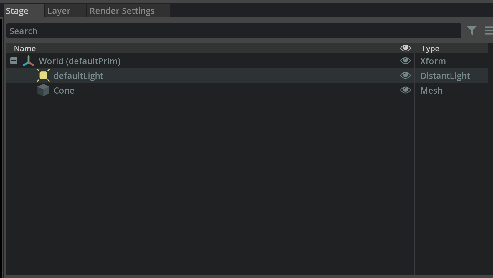

.. _STAGE_API:

Stage
--------------------------------------------------

The stage window allows you to get all the assets in your current USD Scene. Listed in a hierarchical (parent/child) order the Stage offers convenient access and is typically used to navigate large scenes.

Learn more about `Omniverse Stage <https://docs.omniverse.nvidia.com/app_create/prod_extensions/ext_stage.html>`_

Get current stage
#########################

.. code-block:: python

    stage = omni.usd.get_context().get_stage()

Get layer
#########################

.. code-block:: python

    layer = stage.GetRootLayer()
    # get layer path: layer.realpath

Get session layer
#########################

.. code-block:: python

    session_layer = stage.GetSessionLayer()

Get default prim
#########################

.. code-block:: python

    default_prim = stage.GetDefaultPrim()

Set default prim
#########################

.. code-block:: python

    stage.SetDefaultPrim(stage.GetPrimAtPath("/World"))

Traverse all prims
#########################

.. code-block:: python

    prim_list = stage.TraverseAll()

Get prim path and name
#########################

.. code-block:: python

    prim = stage.GetPrimAtPath("/World/Cube")
    prim_path = prim.GetPath()
    prim_name = prim_path.pathString

Create empty prim (xform)
############################

.. code-block:: python

    from omni.physx.scripts import physicsUtils
    physicsUtils.add_xform(stage, "/xform", pxr.Gf.Vec3f(0.0, 0, 0.0))

    # or
    path = omni.usd.get_stage_next_free_path(stage, "/xform", True)
    xform_geom = pxr.UsdGeom.Xform.Define(stage, path)

Set up-axis and units
########################################################

.. code-block:: python

    # set up axis to z
    pxr.UsdGeom.SetStageUpAxis(stage, pxr.UsdGeom.Tokens.z)
    pxr.UsdGeom.SetStageMetersPerUnit(stage, 0.01) # 0.01 meter

Move/Rename prim
############################

.. code-block:: python

    old_prim_name = prim.GetPath().pathString
    new_prim_name = prim.GetPath().GetParentPath()
    new_prim_name = new_prim_name.AppendChild("Door1")
    new_prim_name = omni.usd.get_stage_next_free_path(self.stage, new_prim_name.pathString, False)
    print("new_prim_name: ", new_prim_name)

    move_dict = {old_prim_name: new_prim_name}
    if pxr.Sdf.Path.IsValidPathString(new_prim_name):
        move_dict = {old_prim_name: new_prim_name}
        omni.kit.commands.execute("MovePrims", paths_to_move=move_dict,  on_move_fn=None)
    else:
        carb.log_error(f"Cannot rename {old_prim_name} to {new_prim_name} as its not a valid USD path")

Get/Set Prim Attribute
############################

.. code-block:: python

    test_prim = self.stage.GetPrimAtPath("/World/Looks/component_45146_solid_001_wire1/component_45146_solid_001_wire1")
    attr = test_prim.GetAttribute("inputs:diffuse_texture").Get()
    new_asset_path = str(attr).replace(":","_").replace("@","")
    test_prim.CreateAttribute("inputs:diffuse_texture", pxr.Sdf.ValueTypeNames.String, False).Set(new_asset_path)
