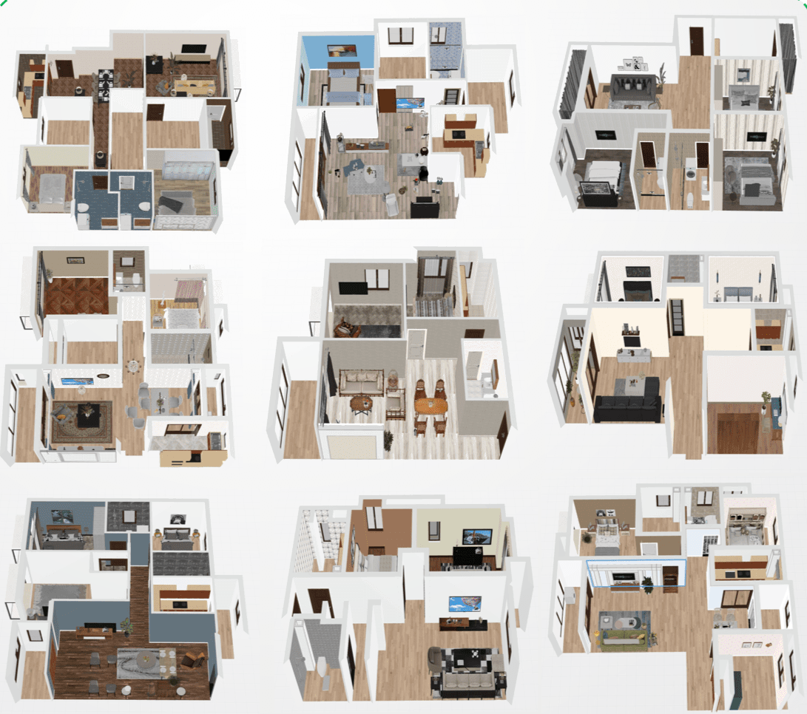
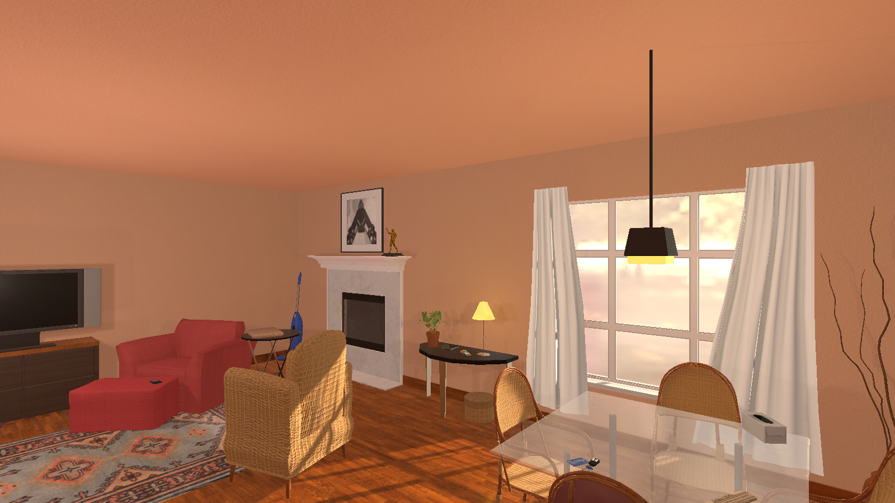

License
===============================================================

A wide range of software and datasets contributes to this toolkit. To encourage copyright protection, we present the licenses that may be necessary for our `VRKitchen2.0` to show our respect to all original works. Users might need some special conditions that should be clear for future users of our toolkit. 

Software
########################################

Omniverse      |Omniverse|
*****************************************

.. |Omniverse| image:: https://img.shields.io/badge/license-individual_enterprise-green
   :target: https://www.nvidia.com/en-us/omniverse/download/
   :alt: Licence

`NVIDIA Omniverse <https://www.nvidia.com/en-us/omniverse/>`_ is an easily extensible platform for 3D design collaboration and scalable multi-GPU, real-time, true-to-reality simulation. Omniverse revolutionizes the way we create and develop as individuals and work together as teams, bringing more creative possibilities and efficiency to 3D creators, developers and enterprises.

Dataset
########################################

3D-Front      |3D-Front|
*****************************************

.. |3D-Front| image:: https://img.shields.io/badge/license-3d_front-green
   :target: https://gw.alicdn.com/bao/uploaded/TB1ZJUfK.z1gK0jSZLeXXb9kVXa.pdf?spm=a1z3i.a4.0.0.3f5beb1digOegr&file=TB1ZJUfK.z1gK0jSZLeXXb9kVXa.pdf
   :alt: Licence

`3D-Front <https://www.nvidia.com/en-us/omniverse/>`_ is large-scale, and comprehensive repository of synthetic indoor scenes highlighted by professionally designed layouts. From layout semantics down to texture details of individual objects, tge dataset is freely available to the academic community and beyond. Currently, 3D-FRONT contains 18,797 rooms diversely furnished by 3D objects. In addition, the 7,302 furniture objects all come with high-quality textures. 

SAPIEN Asset      |SAPIEN|
*****************************************

.. |SAPIEN| image:: https://img.shields.io/badge/license-sapien-green
   :target: https://sapien.ucsd.edu/about#term
   :alt: Licence

.. image:: ./img/articulated_body1.png
   :width: 100%
   :alt: sapien

`PartNet-Mobility dataset in SAPIEN <https://sapien.ucsd.edu/>`_ is a collection of about 2,000 articulated objects with motion annotations and rendernig material. The dataset powers research for generalizable computer vision and manipulation. The dataset is a continuation of ShapeNet and PartNet.

Ai2Thor Asset      |Ai2Thor|
*****************************************

.. |Ai2Thor| image:: https://img.shields.io/badge/license-ai2thor-green
   :target: https://github.com/allenai/ai2thor/blob/main/LICENSE
   :alt: Licence

`Ai2Thor <https://ai2thor.allenai.org/>`_ is a near photo-realistic interactable framework for Embodied AI agents. It contains 200+ scenes, 2600+ objects, and many other key features related to robotics and machine learning.

Tool
########################################

Trescope     |Trescope|
*****************************************

.. |Trescope| image:: https://img.shields.io/badge/license-trescope-green
   :target: https://github.com/alibaba/Trescope/blob/main/LICENSE
   :alt: Licence

.. image:: ./license/trescope.png
   :width: 100%
   :alt: trescope

`Trescope <https://github.com/alibaba/Trescope>`_ is a comprehensive 3D machine learning development tool devoted to improve developing experience and speed in 3D field, which helps researchers and developers to label, debug, visualize various 3D data.