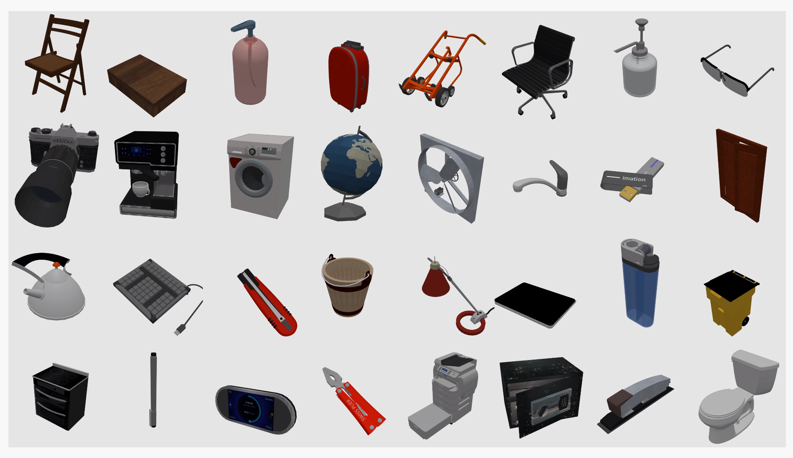

Toolkit overview
===============================================================

To facilitate the study of **indoor scene building** methods and their potential
applications for ``robotics``, ``animation``, and ``Embodied AI``, we introduce VRKITCHEN2.0: a toolkit built by NVIDIA OMNIVERSE that provides flexible pipelines for indoor scene building, scene randomizing, and robotic controls. 

Besides, by combining Python coding in the animation software VRKITCHEN2.0 can assist researches in
creating real-time training and control for robotics in the future.

Demo 1: Build customized high-quality indoor scenes
################################################################

Embodied artificial intelligence (EAI) has attracted significant attention, both in advanced deep
learning models and algorithms and the rapid development of simulated platforms. Many open challenges have been proposed to facilitate EAI research. A critical bottleneck in existing simulated platforms is the **limited number of indoor scenes** that support vision-and-language navigation, object interaction, and complex household tasks :cite:`zhao2021luminous`.

In this tutoral: :ref:`Tutorial Indoor`, we shall present how to import tens of thousands of room layouts from the original `3D-Front dataset` into `Omniverse` to give a photo-realistic effect for EAI tasks.

.. image:: ./img/scene_demo1.*
   :alt: scene_demo1
   :width: 100%

Demo 2: Parsing articulated objects
################################################################

Articulated objects can be defined as objects composed of more than one rigid parts. In our daily life, humans are constantly interacting with a lot of articulated objects such as *door, keyboard, light switch,* and e.t.c. The rigidbody, softbody, articulated object, and liquid compose a large part of our interaction with the world.

In this tutorial: :ref:`Tutorial Articulated Object`, we present how to parse articulated objects in SAPIEN :cite:`xiang2020sapien` (a realistic and physics-rich simulated environment) into `Omniverse`, and present their potential applications for dynmaic controls in the virtual environment.

Demo 3: Set up liquid 
################################################################

Research on studies of softbodies and liquid is very prolific and already achieved important success, although with very different technological appliciable level. The interaction with liquid and softbody in Embodied AI is by far the most productive topic. 

In this tutorial: :ref:`Tutorial Liquid`, we show how to calculate and build liquid in `Omniverse`.

.. image:: ./img/cup_water1.*
   :alt: cup_water1
   :width: 100%

Demo 4: Set up Robot 
################################################################

Embodied AI originally refers to AI for virtual robots, which is the field for solving AI problems for virtual robots that can move, see, speak, and interact in the virtual world and with other virtual robots/ Hopefully, the simulated robot solutions are then **transferred to real world robots**.

In this tutorial (:ref:`Tutorial Robot`), we show how to import a `Franka Emika Panda` robot in `Omniverse`.

.. image:: ./img/franka1.*
   :alt: franka1
   :width: 100%

Demo 5: (Put together) Data labeling 
##############################################################################################

Machine Learning and Deep Learning have been successful because of the increasing amounts of data  and the increasing amounts of computing power (e.g., CPUs, GPUs, TPUs). However, this type of "trainable data" for Embodied AI and robotics are still limited especially when we consider them in virtual environment. 

To enrich the dataset for robotics and EAI community, this tutorial (:ref:`Tutorial Data Labeling`) teaches how to integrete everything together to label a robot task in a *real* scene with *real* physics with scenes, articulated objects, liquid and robots.

.. image:: ./img/data_labeling1.*
   :alt: data_labeling1
   :width: 100%

.. bibliography:: ../refs.bib
