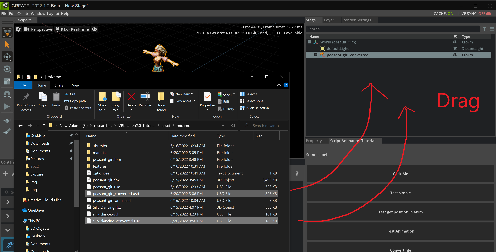
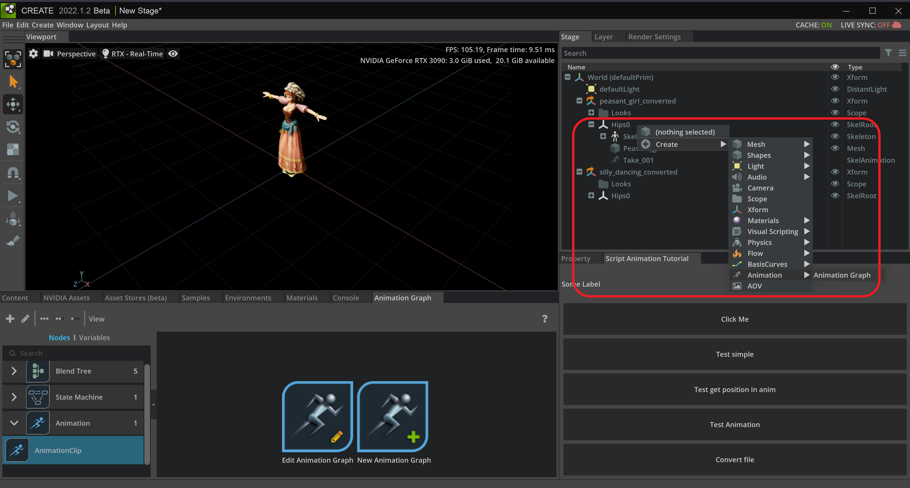

A.2 Build Animation Graph
====================================================================

In this tutorial, we are going to show how to build your own Animation graph to control character animation.

First, drag character and animation file into Omniverse

.. note::

    (Optional) We may apply Python code for import `USD` files (see more: :ref:`_STAGE_API`)

    .. code:: python

        character_path = "/World/peasant_girl_converted"
        anim_path = "/World/silly_dancing_converted"
        
        character_usd = "E:/researches/VRKitchen2.0-Tutorial/asset/mixamo/peasant_girl_converted.usd"
        anim_usd = "E:/researches/VRKitchen2.0-Tutorial/asset/mixamo/silly_dancing_converted.usd"

        prim = self.stage.GetPrimAtPath(character_path)
        if not prim.IsValid():
            prim = self.stage.DefinePrim(character_path)

        success_bool = prim.GetReferences().AddReference(character_usd)
        assert success_bool

        prim = self.stage.GetPrimAtPath(anim_path)
        if not prim.IsValid():
            prim = self.stage.DefinePrim(anim_path)

        success_bool = prim.GetReferences().AddReference(anim_usd)

Second, add animation graph 

