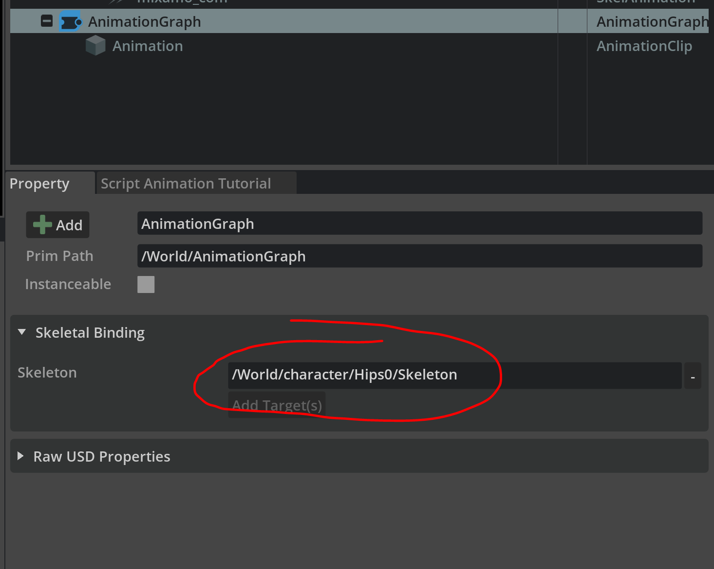
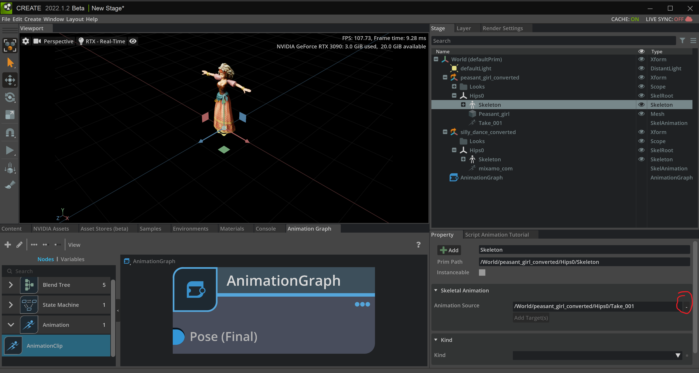
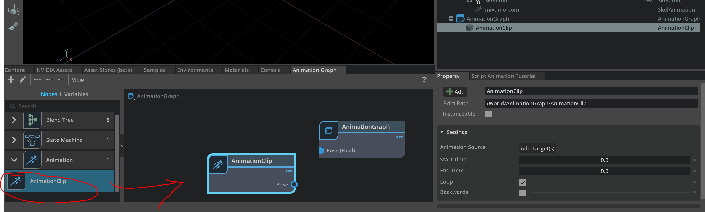
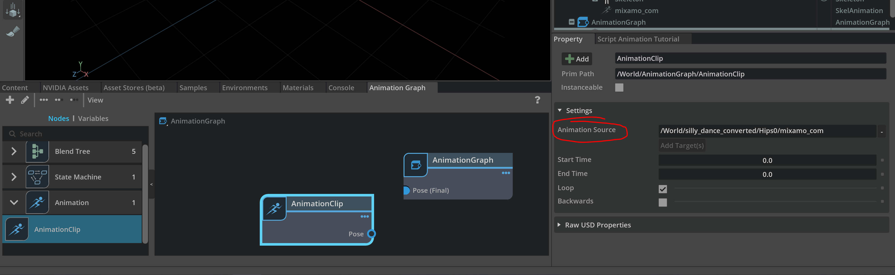
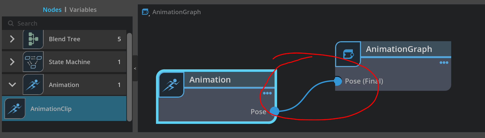

A.2 Build Animation Graph
====================================================================

In this tutorial, we are going to show how to build your own Animation graph to control character animation.

First, drag character and animation file into Omniverse

.. figure:: ./img/graph_import.png
   :alt: anim graph import
   :width: 80%

.. note::

    (Optional) We may apply Python code for import `USD` files (see more: :ref:`STAGE_API`)

.. code:: python

    character_path = "/World/character"
    anim_path = "/World/character_anim_clip"
    
    character_usd = "E:/researches/VRKitchen2.0-Tutorial/asset/mixamo/peasant_girl_converted.usd"
    anim_usd = "E:/researches/VRKitchen2.0-Tutorial/asset/mixamo/silly_dancing_converted.usd"

    prim = self.stage.GetPrimAtPath(character_path)
    if not prim.IsValid():
        prim = self.stage.DefinePrim(character_path)

    success_bool = prim.GetReferences().AddReference(character_usd)
    assert success_bool

    prim = self.stage.GetPrimAtPath(anim_path)
    if not prim.IsValid():
        prim = self.stage.DefinePrim(anim_path)

    success_bool = prim.GetReferences().AddReference(anim_usd)

Create a new animation graph and assign skeleton:

.. figure:: ./img/graph_animgraph.png
   :alt: anim graph import
   :width: 80%

.. note::

    (Optional) We may apply Python code handle animation graph (see more: :ref:`ANIM_GRAPH_API`)

.. code:: python

    anim_graph_path = "/World/AnimationGraph"
    skeleton_path = "/World/character/Hips0/Skeleton"

    ### anim_graph = AnimGraphSchemaTools.createAnimationGraph(stage, Sdf.Path("/World/AnimationGraph"))
    omni.kit.commands.execute("CreateAnimationGraphCommand", \
        path=Sdf.Path(anim_graph_path), skeleton_path=Sdf.Path(skeleton_path))

    
Apply the animation to the ``skeleton root``(e.g. "/World/character/Hips0/Skeleton"):

.. figure:: ./img/graph_apply_animgraph.png
   :alt: anim graph apply
   :width: 80%

.. code:: python

    skel_root_path = "/World/character/Hips0/"
    omni.kit.commands.execute("ApplyAnimationGraphAPICommand", \
        paths=[Sdf.Path(skel_root_path)], animation_graph_path=Sdf.Path(anim_graph_path))

Possibly need to clean the original clip:

.. code:: python

    skeleton_prim = self.stage.GetPrimAtPath(skeleton_path)
    skeleton_bindingAPI = UsdSkel.BindingAPI(skeleton_prim)
    skeleton_bindingAPI.GetAnimationSourceRel().SetTargets([])

Create animation clip node:

.. code:: python

    # create 
    omni.kit.commands.execute(
        'CreatePrimCommand',
        prim_type="AnimationClip",
        prim_path="/World/AnimationGraph/Animation",
        select_new_prim=True,
    )

Add animation clip target source: 

.. code:: python

    animclip_prim = self.stage.GetPrimAtPath("/World/AnimationGraph/Animation")
    # animclip_bindingAPI = UsdSkel.BindingAPI(animclip_prim)

    anim_clip = AnimGraphSchema.AnimationClip(animclip_prim)
    source_rel = anim_clip.GetInputsAnimationSourceRel()

    omni.kit.commands.execute(
        'omni.anim.graph.ui.scripts.command.SetRelationshipTargetsCommand',
        relationship=source_rel,
        targets=[Sdf.Path("/World/character_anim_clip/Hips0/mixamo_com")]
    )

Finally, connect connect node:

