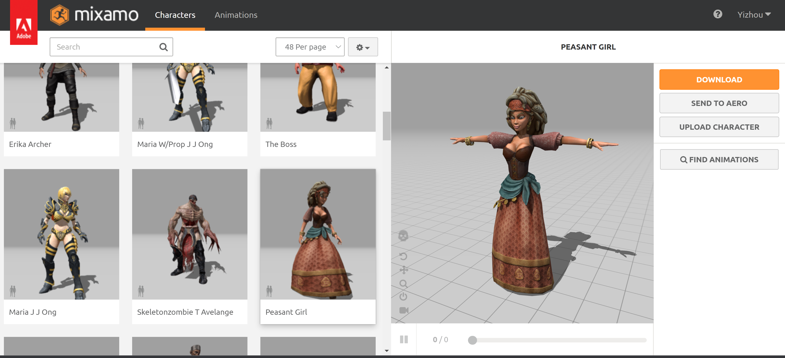

Animation Tutorial 1: Bring Mixamo Animation to Omniverse
====================================================================

In this part, we are going to show how to bring characters and animation clips from `Adobe Mixamo <https://www.mixamo.com/#/>`_ into ``Omniverse Create``

0. Requirements
#######################################

.. warning::

    Please refer to the licenses (:ref:`Licenses`) if necessary.

* `Adobe Mixamo <https://www.mixamo.com/#/>`_
* `Autodesk Maya <https://www.autodesk.com/products/maya/overview>`_
* `Nvidia Omniverse <https://www.nvidia.com/en-us/omniverse/>`_

1. Download character & Animation from MIXAMO
#######################################################################

