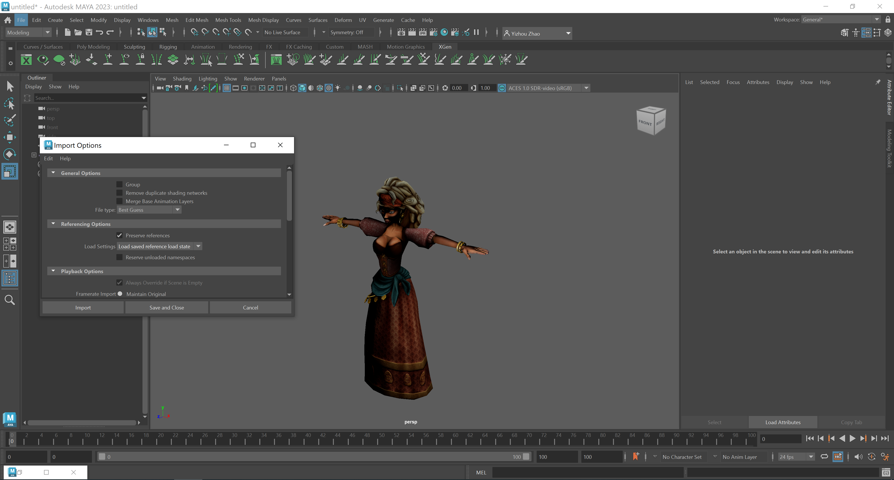
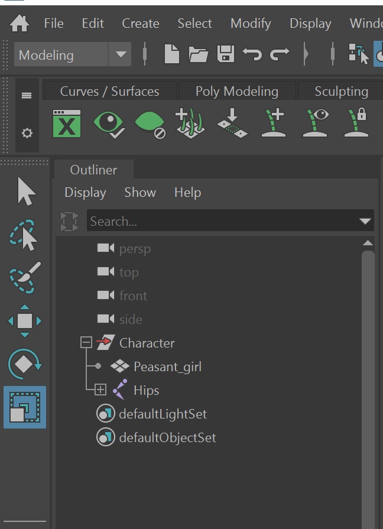
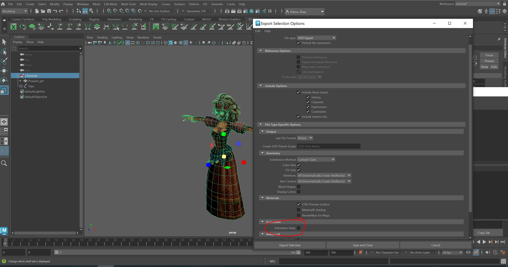
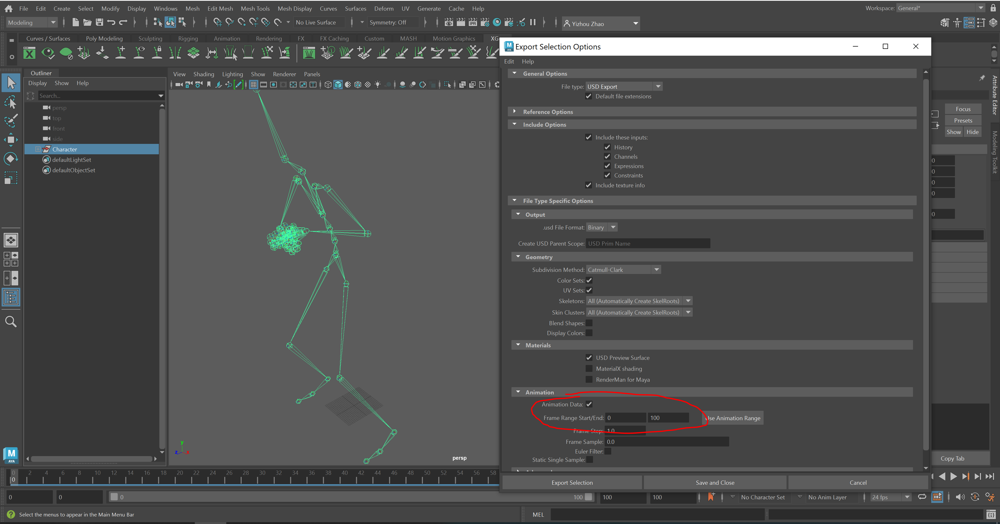
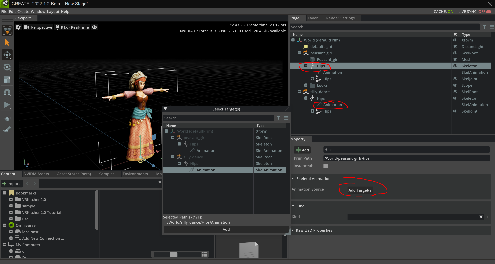

Animation Tutorial 1: Bring Mixamo Animation to Omniverse
====================================================================

In this part, we are going to show how to bring characters and animation clips from `Adobe Mixamo <https://www.mixamo.com/#/>`_ into ``Omniverse Create``

0. Requirements
#######################################

.. warning::

    Please refer to the licenses (:ref:`Licenses`) if necessary.

* `Adobe Mixamo <https://www.mixamo.com/#/>`_
* `Autodesk Maya 2023 <https://www.autodesk.com/products/maya/overview>`_ (We the Maya version >= 2022) to import ``mayaUSD`` module.
* `Nvidia Omniverse <https://www.nvidia.com/en-us/omniverse/>`_

1. Download character & Animation from MIXAMO
#######################################################################

Visit `Adobe Mixamo <https://www.mixamo.com/#/>`_, then save the character (e.g. peasant_girl.fbx) and the animation clip (e.g. Silly Dancing.fbx)

.. figure:: ./img/amixamo.png
   :alt: log image
   :width: 50%

.. note::

    The ``animation clip`` can be saved with skeletal animation only (without skin).

2. Import FBX into maya
#######################################################################

We can also try import with Python code:

.. code-block:: python

    import maya.cmds as cmds

    fbx_path = "E:/researches/VRKitchen2.0-Tutorial/asset/mixamo/peasant_girl.fbx"
    cmds.file(fbx_path, i=True, type='Fbx')

3. Group character and export
#######################################################################

.. code-block:: python

    cmds.group( 'Peasant_girl', 'Hips', n='Character')

    # file -force -options ";exportUVs=1;exportSkels=auto;exportSkin=auto;exportBlendShapes=0;exportDisplayColor=0;exportColorSets=1;defaultMeshScheme=catmullClark;animation=0;eulerFilter=0;staticSingleSample=0;startTime=0;endTime=115;frameStride=1;frameSample=0.0;defaultUSDFormat=usdc;parentScope=;shadingMode=useRegistry;convertMaterialsTo=[UsdPreviewSurface];exportInstances=1;exportVisibility=1;mergeTransformAndShape=1;stripNamespaces=0" -typ "USD Export" -pr -es "E:/researches/VRKitchen2.0-Tutorial/asset/mixamo/peasant_girl.usd";
    
    options = ";exportUVs=1;exportSkels=auto;exportSkin=auto;exportBlendShapes=0;exportDisplayColor=0;exportColorSets=1;defaultMeshScheme=catmullClark;animation=0;eulerFilter=0;staticSingleSample=0;startTime=0;endTime=115;frameStride=1;frameSample=0.0;defaultUSDFormat=usdc;parentScope=;shadingMode=useRegistry;convertMaterialsTo=[UsdPreviewSurface];exportInstances=1;exportVisibility=1;mergeTransformAndShape=1;stripNamespaces=0"

    usd_path = "E:/researches/VRKitchen2.0-Tutorial/asset/mixamo/peasant_girl.usd"
    cmds.file(usd_path, force = True, options = options, type="USD Export", exportSelected=True, preserveReferences=True)

5. Import and export animation
#######################################################################

Now we do the same step for the animation clip.

.. code-block:: python

    # import animation clip
    fbx_path = "E:/researches/VRKitchen2.0-Tutorial/asset/mixamo/Silly Dancing.fbx"
    cmds.file(fbx_path, i=True, type='Fbx')

    # group skeleton only
    cmds.group('Hips', n='Character')

    # output animation
    max_time = int(cmds.playbackOptions(maxTime=-1, q=True)) # get timeline max time

    # file -force -options ";exportUVs=1;exportSkels=auto;exportSkin=auto;exportBlendShapes=0;exportDisplayColor=0;exportColorSets=1;defaultMeshScheme=catmullClark;animation=1;eulerFilter=0;staticSingleSample=0;startTime=0;endTime=100;frameStride=1;frameSample=0.0;defaultUSDFormat=usdc;parentScope=;shadingMode=useRegistry;convertMaterialsTo=[UsdPreviewSurface];exportInstances=1;exportVisibility=1;mergeTransformAndShape=1;stripNamespaces=0" -typ "USD Export" -pr -es "E:/researches/VRKitchen2.0-Tutorial/asset/mixamo/silly_dance.usd";

    options =f";exportUVs=1;exportSkels=auto;exportSkin=auto;exportBlendShapes=0;exportDisplayColor=0;exportColorSets=1;defaultMeshScheme=catmullClark;animation=1;eulerFilter=0;staticSingleSample=0;startTime=0;endTime={max_time};frameStride=1;frameSample=0.0;defaultUSDFormat=usdc;parentScope=;shadingMode=useRegistry;convertMaterialsTo=[UsdPreviewSurface];exportInstances=1;exportVisibility=1;mergeTransformAndShape=1;stripNamespaces=0"
    
    usd_path = "E:/researches/VRKitchen2.0-Tutorial/asset/mixamo/silly_dance2.usd"
    cmds.file(usd_path, force = True, options = options, type="USD Export", exportSelected=True, preserveReferences=True)

6. Load character and animation into Omnvierse
#######################################################################

Finally, load character and select your animation clip in Omnvierse. 

