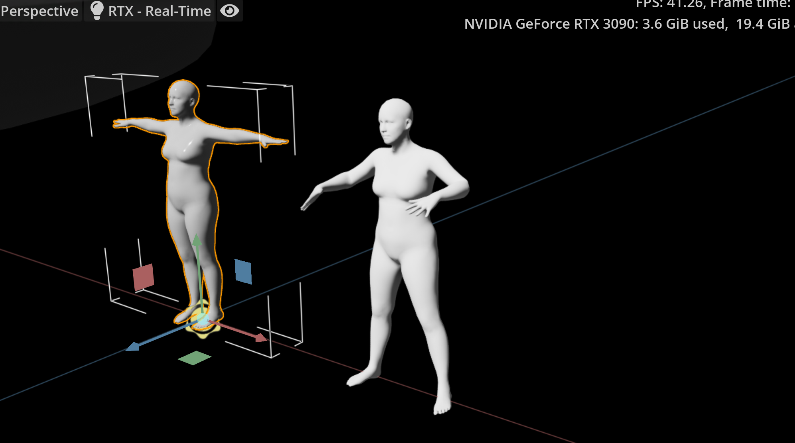
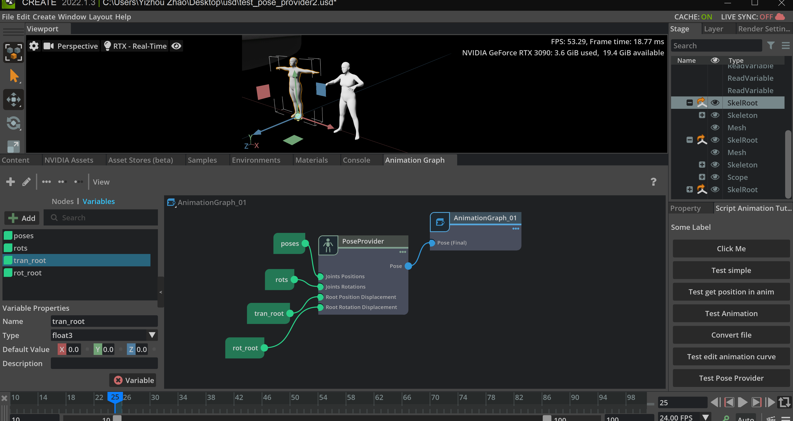

A.3 Bring arbitrary animation in SMPL format
====================================================================

In this tutorial, we are going to show how to bring animation of SMPL format into Omniverse.

For more information about SMPL, see

* `SMPL-X <https://smpl-x.is.tue.mpg.de/login.php>`_
* `VPoser <https://github.com/nghorbani/human_body_prior>`_ (human_body_prior)
* `SMPL Blender addon <https://github.com/Meshcapade/SMPL_blender_addon>`_

Bring animation into the stage:

Set up an animation graph like this:

Get animation information from script:

.. code-block:: python

    animprim = stage.GetPrimAtPath("/World/chicken2/f_avg_root/Animation")

    anim = UsdSkel.Animation(animprim) # from pxr import UsdSkel
    trans = anim.GetTranslationsAttr().Get(current_frame_code) # e.g. current_frame_code = 0
    quats = anim.GetRotationsAttr().Get(current_frame_code)

Set animation information from script:

.. code-block:: python

    trans = [carb.Float3(e[0],e[1],e[2]) for e in trans]
    quats =  [carb.Float4(e.imaginary[0], e.imaginary[1], e.imaginary[2], e.real) for e in quats ]

    character.set_variable("poses", trans)
    character.set_variable("rots", quats)

