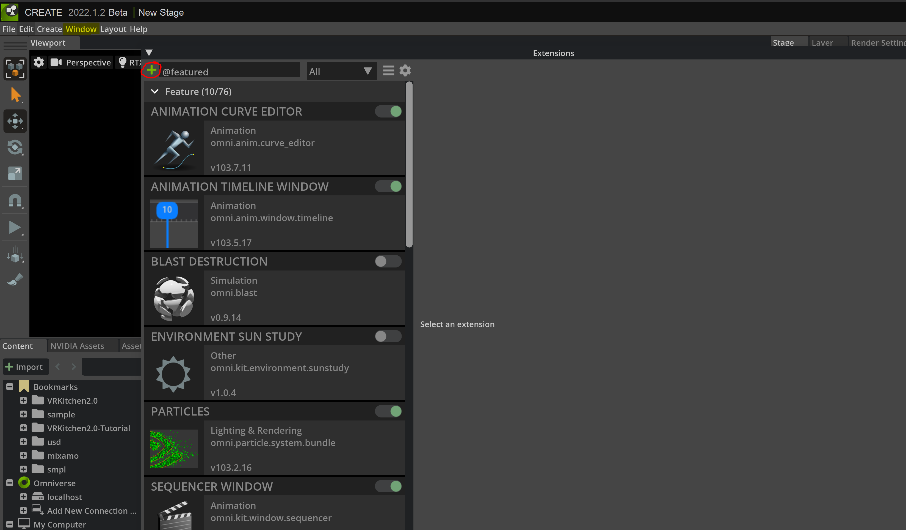
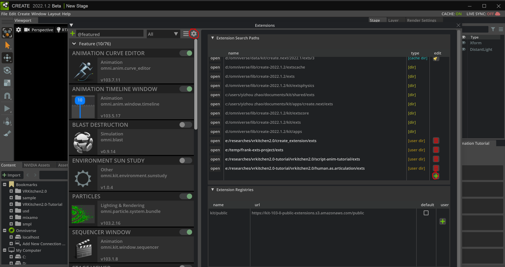

B.1 Build your first extension in Omnverse
====================================================================

In this tutorial, we are going to show how to create an extension in Omniverse create. The official documentaion can be found `here <https://docs.omniverse.nvidia.com/prod_extensions/prod_extensions/overview.html>`_.

.. raw:: html

    

        <iframe width="853" height="480" src="https://www.youtube.com/embed/eGxV_PGNpOg" title="How to Build an Omniverse Extension in Less Than 10 Minutes" frameborder="0" allow="accelerometer; autoplay; clipboard-write; encrypted-media; gyroscope; picture-in-picture" allowfullscreen></iframe>
    

Method one: start an extension in Omniverse
-------------------------------------------------

Go to ``Menu bar`` -> ``Window`` -> ``Extensions``, click the ``plus`` sign on the top left conner.

Set up the file name and extension name and click ``OK``. If on your computer, the `Visual Studio code <https://code.visualstudio.com/>`_ is installed, the script will be open automatically.

Well done!

Method two: add an existing project
-------------------------------------------------

Go to ``Menu bar`` -> ``Window`` -> ``Extensions``, click the ``setting gear`` sign on the top.

Then add your existing project with the path ending with ``.exts``.

Well done!

